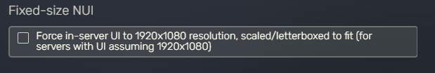

# 🖥️ Supported Resolutions

Tested and supported resolutions for all our scripts:

* **4320p (8K)**: 7680x4320
* **2160p (4K)**: 3840x2160
* **1440p (2K)**: 2560x1440
* **1080p (HD)**: 1920x1080
* **720p (HD)**: 1280x720
* **480p (SD)**: 854x480
* **360p (SD)**: 640x360

If you have a resolution other than <mark style="color:green;">**16:9**</mark>, you just need to enable this setting in FiveM\

<figure><figcaption>
Fivem > Settings > Game
</figcaption></figure>

