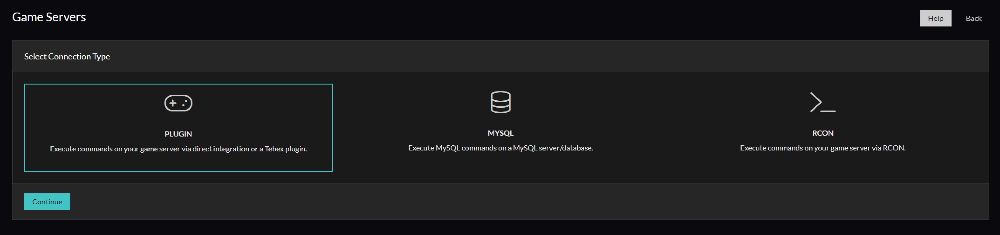
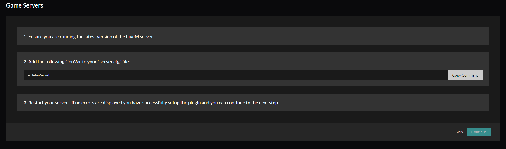
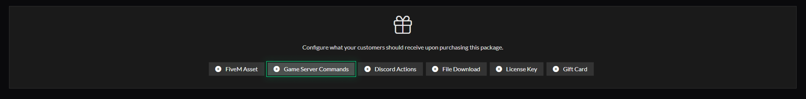
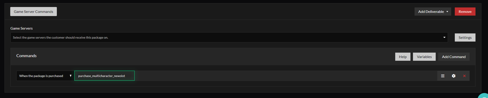
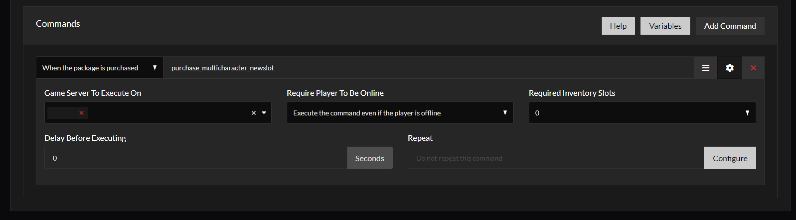
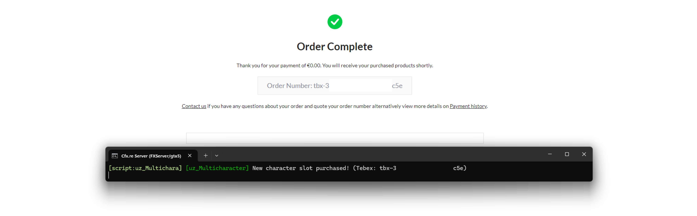

# 🛠️ Tebex Integration

<figure><figcaption>
tebex > Game Servers > Connect Game Server
</figcaption></figure>

Paste the Tebex secret code to be given into the <mark style="color:green;">**server.cfg**</mark>

<figure><figcaption></figcaption></figure>

Now that your server connection part is complete, you can create a product for the script you need and we can link it.

<figure><figcaption>
tebex > Package > Create Package
</figcaption></figure>

Write the command needed for your script _<mark style="color:green;">(multi character is used in this example)</mark>_

<figure><figcaption></figcaption></figure>

<figure><figcaption></figcaption></figure>

<figure><figcaption></figcaption></figure>

