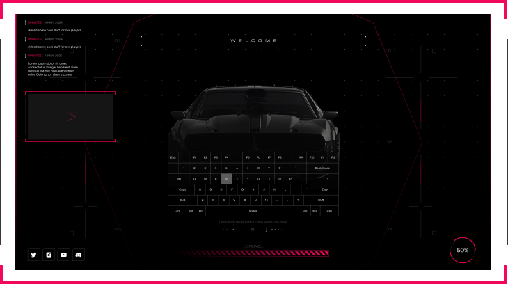
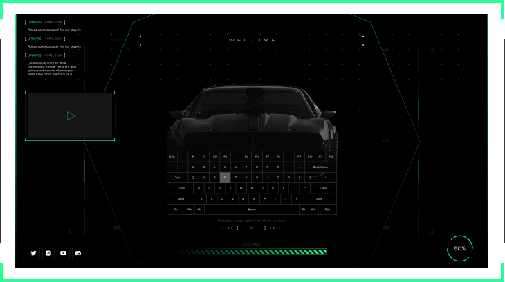

# Customize


```json
"UIColor": "#25ff96"
```


<div align="left" data-full-width="true"><figure><figcaption><p>#F2075C</p></figcaption></figure> <figure><figcaption></figcaption></figure></div>

***


```json
"VideoID": "GPzMyhWXPC8"
```


<details>

<summary><em>How is it used ?</em></summary>

1. _Copy your YouTube link_ ([https://www.youtube.com/watch?v=GPzMyhWXPC8](https://www.youtube.com/watch?v=GPzMyhWXPC8))
2. _Delete everything before_ <mark style="color:green;">**'v='**</mark> ([GPzMyhWXPC8](https://www.youtube.com/watch?v=GPzMyhWXPC8)).

</details>

***




```json
{
  "Lang": {
    "Update": "updates",
    "Header": "welcome uzstore",
    "Loading": "LOADING..."
  },
  "UIColor": "#25ff96",
  "VideoID": "GPzMyhWXPC8",
  "Social": {
    "Twitter": "https://twitter.com/",
    "Instagram": "https://www.instagram.com/",
    "Youtube": "https://www.youtube.com/@esckaybeden",
    "Discord": "https://discord.gg/uzstore"
  },
  "Update": [
    {
      "text": "Added some cool stuff for our players",
      "date": "4 MAY, 2024"
    },
    {
      "text": "Resmon (ms) values have been improved",
      "date": "5 MAY, 2024"
    },
    {
      "text": "Lorem ipsum dolor sit amet consectetur. Integer hendrerit diam quisque est nec nisl ullamcorper enim. Odio tortor viverra cursus",
      "date": "6 MAY, 2024"
    },
    {
      "text": "Resmon (ms) values have been improved",
      "date": "7 MAY, 2024"
    }
  ],
  "Keys": {
    "H": "Opens TrygonHudV2.5 settings menu",
    "I": "Opens Trygon Inventory",
    "G": "Toggle Engine",
    "L": "Toggle Chat",
    "Y": "Toggle Cruse Control"
  }
}
```




