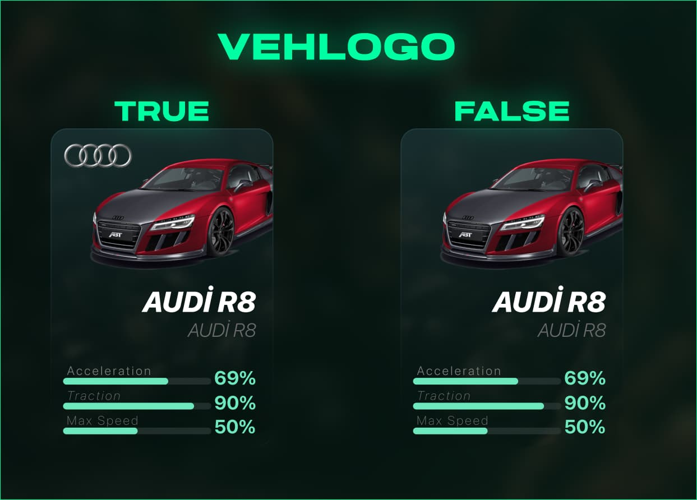

# Customize


```lua
Vehicle Logo
```


<figure><figcaption></figcaption></figure>




```lua
Customize = {    
    Framework = "QBCore",               -- QBCore - ESX - NewESX - OldQBCore (Write the framework you used as in the example)
    Mysql = "oxmysql",                  -- oxmysql - ghmattimysql - mysql-async (Write the sql script you use as in the example)
    AllCarsRestartInGarage = true,      -- Sends all vehicles to the garage when restarted
    VehLogo = false,                    -- Allows you to toggle tool brand icons in the UI
    PriceType = 'cash',                 -- cash - bank (Represents the form of money she will receive from the player)
    GaragesPrice = 0,                   -- amount to be taken when spawning a car
    isPrice = false,                    -- if it is closed it will spawn the agent without checking the money
    AllDamageSave = true,               -- It also allows for the recording of vehicle damages
    ModificationSave = true,            -- It also allows for the recording of vehicle modifications

    Lang = {
        ['TotalCars'] = 'TOTAL CARS',
        ['Impound'] = 'IMPOUND GARAGE',
        ['OutGarage'] = 'OUT GARAGE',
        ['InGarage'] = 'IN GARAGE',
        ['Search'] = 'TYPE CAR NAME HERE ...',
        ['Acceleration'] = 'Acceleration',
        ['Traction'] = 'Traction',
        ['MaxSpeed'] = 'Max Speed',
        ['StickerFee'] = 'vehicle sticker fee',
        ['Draw3DText'] = '[E] GARAGE'
    },

    GetVehFuel = function(Veh)
        return GetVehicleFuelLevel(Veh) -- exports["uz_fuel"]:GetFuel(Veh) - exports["LegacyFuel"]:GetFuel(Veh) - GetVehicleFuelLevel(Veh)
    end,

    SetVehFuel = function(Veh, Fuel)
        return SetVehicleFuelLevel(Veh, Fuel) -- exports['uz_fuel']:SetFuel(Veh, Fuel) - exports['LegacyFuel']:SetFuel(Veh, Fuel) - SetVehicleFuelLevel(Veh, Fuel)
    end,

    CarNotSpawnNotift = function()  -- You should adjust it according to the notify you are using on your server.
        print('All designated locations are full.')
    end,

    Garages = {
        {
            Pos = vector3(120.61, 6623.28, 31.96),                  -- Represents NPC and Blip location
            NpcHash = "s_m_y_valet_01",                             -- (https://docs.fivem.net/docs/game-references/ped-models/)
            NpcHeading = 226.53,                                    -- Represents the npc's view direction
            Blip = "Paleto Bay",                                    -- Specifies the name to appear on the map
            BlipSprite = 357,                                       -- (https://docs.fivem.net/docs/game-references/blips/#blips)
            BlipDisplay = 4,                                        -- (https://docs.fivem.net/natives/?_0x9029B2F3DA924928)
            BlipScale = 0.5,                                        -- Sets icon size
            BlipColour = 18,                                        -- (https://docs.fivem.net/docs/game-references/blips/#blip-colors)
            VehPutPos = vector3(132.73, 6629.2, 31.14),             -- The location where the car will be put in the garage
            VehSpawnPos = { -- Location where the car will be picked up from the garage
                [1] = vector4(127.67, 6590.31, 31.4, 267.53),
                [2] = vector4(132.97, 6585.3, 31.54, 273.22)
            },
            Camera = {
                vehSpawn = vector4(130.33, 6607.72, 31.3, 355.3),   -- Represents the place where the car will be displayed in the ui
                locationPos = vector3(117.0, 6608.0, 34.0),         -- Camera location
                locationRot = vector3(-8.0, 0.0, 265.4),            -- Camera location
                fov = 35.0                                          -- Camera Field of View (Fov)
            },
            Type = 'car' -- sea - car - air (Type the type of vehicle you want to use as in the example)
        },
        {
            Pos = vector3(-1381.94, 6740.05, 5.88),
            NpcHash = "s_m_y_valet_01",
            NpcHeading = 251.68,
            Blip = "Yacht",
            BlipSprite = 357,
            BlipDisplay = 4,
            BlipScale = 0.5,
            BlipColour = 18,
            VehPutPos = vector3(-1389.3, 6742.51, 11.98),
            VehSpawnPos = {
                [1] = vector4(-1389.3, 6742.51, 11.98, 250.58)
            },
            Camera = {
                vehSpawn = vector4(-1389.3, 6742.51, 11.98, 250.58),
                locationPos = vector3(-1382.87, 6736.76, 13.56),
                locationRot = vector3(-8.0, 0.0, 44.05),
                fov = 90.0
            },
            Type = 'air'
        },
        {
            Pos = vector3(-1608.82, 5261.94, 3.97),
            NpcHash = "s_m_y_valet_01",
            NpcHeading = 124.58,
            Blip = "Yacht",
            BlipSprite = 357,
            BlipDisplay = 4,
            BlipScale = 0.5,
            BlipColour = 18,
            VehPutPos = vector3(-1602.52, 5259.98, 0.0),
            VehSpawnPos = {
                [1] = vector4(-1602.52, 5259.98, 0.0, 201.8)
            },
            Camera = {
                vehSpawn = vector4(-1602.52, 5259.98, 0.0, 201.8),
                locationPos = vector3(-1595.74, 5252.49, 2.8),
                locationRot = vector3(-10.0, 0.0, 41.93),
                fov = 70.0
            },
            Type = 'sea'
        },
        { -- Motel Garage
            Pos = vector3(273.86, -345.35, 44.92),
            NpcHash = "s_m_y_valet_01",
            NpcHeading = 66.8,
            Blip = "Motel Parking",
            BlipSprite = 357,
            BlipDisplay = 4,
            BlipScale = 0.5,
            BlipColour = 18,
            VehPutPos = vector3(271.64, -337.34, 44.34),
            VehSpawnPos = {
                [1] = vector4(270.62, -318.94, 44.27, 248.47),
                [2] = vector4(269.3, -322.28, 44.27, 249.89),
                [3] = vector4(268.44, -325.72, 44.27, 250.41),
                [4] = vector4(268.04, -329.18, 44.27, 248.41),
            },
            Camera = {
                vehSpawn = vector4(266.62, -332.11, 44.34, 250.03),
                locationPos = vector3(270.5, -337.02, 46.3),
                locationRot = vector3(-14.0, 0.0, 36.0),
                fov = 60.0
            },
            Type = 'car'
        },
        { -- Red Garage
            Pos = vector3(-331.55, -781.93, 33.96),
            NpcHash = "s_m_y_valet_01",
            NpcHeading = 45.79,
            Blip = "Red Parking",
            BlipSprite = 357,
            BlipDisplay = 4,
            BlipScale = 0.5,
            BlipColour = 18,
            VehPutPos = vector3(-332.85, -765.46, 33.97),
            VehSpawnPos = {
                [1] = vector4(-328.85, -751.03, 33.97, 3.27),
                [2] = vector4(-331.64, -751.98, 33.97, 0.03),
                [3] = vector4(-334.56, -751.05, 33.97, 14.44),
                [4] = vector4(-337.2, -751.24, 33.97, 27.53),
            },
            Camera = {
                vehSpawn = vector4(-323.72, -772.64, 33.39, 302.19),
                locationPos = vector3(-329.99, -772.23, 34.6),
                locationRot = vector3(-12.0, 0.0, -98.0),
                fov = 60.0
            },
            Type = 'car'
        },
        { -- Spanish Ave Garage
            Pos = vector3(-1160.81, -740.2, 19.74),
            NpcHash = "s_m_y_valet_01",
            NpcHeading = 129.57,
            Blip = "Spanish Ave Parking",
            BlipSprite = 357,
            BlipDisplay = 4,
            BlipScale = 0.5,
            BlipColour = 18,
            VehPutPos = vector3(-1167.64, -739.02, 19.83),
            VehSpawnPos = {
                [1] = vector4(-1146.01, -745.71, 19.64, 282.49),
                [2] = vector4(-1144.4, -748.75, 19.48, 283.42),
                [3] = vector4(-1141.56, -751.87, 19.33, 285.86),
                [4] = vector4(-1138.99, -754.47, 19.21, 290.38),
            },
            Camera = {
                vehSpawn = vector4(-1166.14, -749.47, 19.26, 265.17),
                locationPos = vector3(-1163.2, -744.59, 20.1),
                locationRot = vector3(-12.0, 0.0, 150.2),
                fov = 60.0
            },
            Type = 'car'
        },
        { -- Caears 24 Garage
            Pos = vector3(69.02, 11.54, 68.95),
            NpcHash = "s_m_y_valet_01",
            NpcHeading = 257.7,
            Blip = "Caears 24 Parking",
            BlipSprite = 357,
            BlipDisplay = 4,
            BlipScale = 0.5,
            BlipColour = 18,
            VehPutPos = vector3(65.43, 21.19, 69.47),
            VehSpawnPos = {
                [1] = vector4(54.6, 19.43, 69.51, 339.3),
                [2] = vector4(57.53, 18.16, 69.3, 317.63),
                [3] = vector4(60.59, 17.29, 69.17, 336.98),
                [4] = vector4(63.78, 16.32, 69.13, 335.64),
            },
            Camera = {
                vehSpawn = vector4(69.62, 24.0, 69.46, 65.85),
                locationPos = vector3(67.67, 19.88, 70.2),
                locationRot = vector3(-18.0, 0.0, -25.82),
                fov = 60.0
            },
            Type = 'car'
        },
        { -- Laguna Garage
            Pos = vector3(363.36, 296.94, 103.5),
            NpcHash = "s_m_y_valet_01",
            NpcHeading = 255.6,
            Blip = "Laguna Parking",
            BlipSprite = 357,
            BlipDisplay = 4,
            BlipScale = 0.5,
            BlipColour = 18,
            VehPutPos = vector3(365.8, 290.11, 103.4),
            VehSpawnPos = {
                [1] = vector4(370.63, 283.79, 103.25, 342.99),
                [2] = vector4(374.4, 282.7, 103.18, 338.93),
                [3] = vector4(378.25, 281.49, 103.12, 339.82),
            },
            Camera = {
                vehSpawn = vector4(360.0, 278.94, 103.28, 217.25),
                locationPos = vector3(364.62, 281.18, 104.31),
                locationRot = vector3(-18.0, 0.0, 113.82),
                fov = 60.0
            },
            Type = 'car'
        },
        { -- Beach Garage
            Pos = vector3(-1183.2, -1508.35, 4.38),
            NpcHash = "s_m_y_valet_01",
            NpcHeading = 311.19,
            Blip = "Beach Parking",
            BlipSprite = 357,
            BlipDisplay = 4,
            BlipScale = 0.5,
            BlipColour = 18,
            VehPutPos = vector3(-1183.63, -1501.8, 4.38),
            VehSpawnPos = {
                [1] = vector4(-1182.55, -1495.07, 4.38, 127.5),
                [2] = vector4(-1184.72, -1492.75, 4.38, 130.58),
                [3] = vector4(-1186.17, -1490.39, 4.38, 125.71),
                [4] = vector4(-1188.24, -1487.97, 4.38, 129.75),
            },
            Camera = {
                vehSpawn = vector4(-1171.47, -1493.24, 4.38, 164.55),
                locationPos = vector3(-1175.87, -1491.87, 5.6),
                locationRot = vector3(-18.0, 0.0, 250.5),
                fov = 70.0
            },
            Type = 'car'
        },
        { -- Pillbox Hill Garage
            Pos = vector3(214.54, -806.95, 30.8),
            NpcHash = "s_m_y_valet_01",
            NpcHeading = 339.97,
            Blip = "Pillbox Hill Parking",
            BlipSprite = 357,
            BlipDisplay = 4,
            BlipScale = 0.5,
            BlipColour = 18,
            VehPutPos = vector3(211.92, -800.04, 30.89),
            VehSpawnPos = {
                [1] = vector4(209.64, -791.39, 30.5, 248.63),
                [2] = vector4(211.14, -788.75, 30.33, 249.13),
                [3] = vector4(210.77, -785.82, 30.93, 250.0),
                [4] = vector4(212.3, -783.39, 30.9, 251.18),
            },
            Camera = {
                vehSpawn = vector4(236.95, -783.71, 30.63, 179.64),
                locationPos = vector3(233.37, -789.9, 30.6),
                locationRot = vector3(0.0, 0.0, -25.0),
                fov = 50.0
            },
            Type = 'car'
        },
    }
}
```



