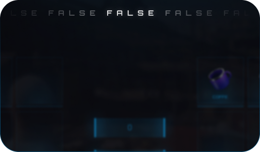

# Customize



```lua
PlayerDisplay = true
```


<div><figure><figcaption><p>True</p></figcaption></figure> <figure><figcaption><p>False</p></figcaption></figure></div>

***



```lua
InventoryOpenControl = 'I'
```



***



```lua
NotificationTime = 2150
```





***


```lua
DropMaxWeight = 200,
DropMaxSlot = 15,

TrunkMaxWeight = 45,
TrunkMaxSlot = 7,
  
GloveMaxWeight = 32,
GloveMaxSlot = 4,
```




***


```lua
PlayerMaxWeight = 67,
PlayerMaxSlot = 16,
PlayerInventoryLabel = 'My Bag',
```


<div data-full-width="false"><figure><figcaption></figcaption></figure></div>

***




```lua
Customize = {
    Framework = "QBCore", -- QBCore | ESX | NewESX | OldQBCore (Write the framework you used as in the example)
    ServerName = 'UZ STORE',
    SecondTitle = 'for a quality roleplay!',


    PlayerDisplay = false,
    InventoryOpenControl = 'I',
    NotificationTime = 2150,

    PlayerMaxWeight = 120, -- KG
    PlayerMaxSlot = 30,
    PlayerInventoryLabel = 'My Bag',
    BlackInventoryLabel = 'Already in Use',

    DropMaxWeight = 200,
    DropMaxSlot = 30,
    
    TrunkMaxWeight = 45,
    TrunkMaxSlot = 25,
    
    GloveMaxWeight = 25,
    GloveMaxSlot = 5,
    

    StashPersonalizedLabel = ' Special',
    DefaultStashMaxSlot = 9,
    DefaultStashMaxWeight = 100,
}

Customize.VehFrontTrunk = {
    [`gp1`] = true,
    [`t20`] = true,
    [`re7b`] = true,
    [`ninef`] = true,
    [`adder`] = true,
    [`tyrus`] = true,
    [`tyrant`] = true,
    [`vagner`] = true,
    [`reaper`] = true,
    [`comet2`] = true,
    [`comet3`] = true,
    [`jester`] = true,
    [`jester2`] = true,
    [`cheetah`] = true,
    [`infernus`] = true,
    [`tempesta`] = true,
    [`zentorno`] = true,
    [`stingergt`] = true,
    [`pfister811`] = true,
    [`penetrator`] = true,
    [`prototipo`] = true,
    [`cheetah2`] = true,
    [`turismor`] = true,
    [`entityxf`] = true,
    [`turismo2`] = true,
    [`italigtb`] = true,
    [`surfer2`] = true,
    [`autarch`] = true,
    [`ardent`] = true,
    [`bullet`] = true,
    [`monroe`] = true,
    [`ninef2`] = true,
    [`surfer`] = true,
    [`osiris`] = true,
    [`nero2`] = true,
    [`vacca`] = true,
    [`nero`] = true,
    [`fmj`] = true,
}


CustomizeMarker = {

    Marker = function(Position)
        DrawMarker(20, Position.x, Position.y, Position.z, 0, 0, 0, 0, 0, 0, 0.3, 0.3, 0.3, 255, 128, 0, 150, false, false, false, 1, false, false, false)
    end,

    DrawTextDisplay = false,
    DrawText = function(Text, Position)
        local text = Text
        local onScreen, _x, _y = World3dToScreen2d(Position.x, Position.y, Position.z)
        local px, py, pz = table.unpack(GetGameplayCamCoords())
        SetTextScale(0.25, 0.25)
        SetTextFont(8)
        SetTextProportional(1)
        SetTextEntry("STRING")
        SetTextCentre(1)
        AddTextComponentString(text)
        DrawText(_x, _y)
        DrawRect(_x, _y + 0.0125, 0.015 + (string.len(text)) / 330, 0.03, 41, 11, 41, 68)
    end,

    MarkerNuiOpenDistance = 2.0,
    Open = function()
        if IsControlJustPressed(0, 38) then
            return true
        end
    end
}
```





```lua
CustomizeItems = {
    ['info'] = {
        Name = 'info',
        Label = 'info',
        Image = '',
        Description = function(info)
            if info ~= nil then
                return 'Info: '..info?.info1..' \n Info2: '..info?.info2..' '
            else
                return 'item name'
            end
        end,
        Weight = 2.5,
    },


    ['uzstore'] = {
        Name = 'uzstore',
        Label = 'UZStore',
        Image = '',
        Description = '♥ UZStore ♥',
        Weight = 2.5,
    },
    ['noos'] = {
        Name = 'noos',
        Label = 'noos',
        Image = '',
        Description = 'noosssssss',
        Weight = 2.5,
        isUse = true,
    },
    ['water'] = {
        Name = 'water',
        Label = '🏄🏼‍♀️Water',
        Image = '',
        Description = '🕵🏻 Are You Thirsty 🕵🏻',
        Weight = 0.5,
        
        isUse = true,
    },
    ['wood'] = {
        Name = 'wood',
        Label = 'Wood',
        Image = '',
        Description = 'alşksdnşlkasndşlkasşldn',
        Weight = 0.5,
        isUse = false,
    },
    ['coffee'] = {
        Name = 'coffee',
        Label = 'Coffee',
        Image = '',
        Description = "If you want to have a hot coffee, I'm here!",
        Weight = 0.2,
        isUse = true,
    },
    ['tosti'] = {
        Name = 'tosti',
        Label = 'tosti',
        Image = '',
        Description = "tosti",
        Weight = 0.2,
        isUse = true,
    },

    ['pistol_suppressor'] = {
        Name = 'pistol_suppressor',
        Label = 'Suppressor',
        Image = '',
        Description = 'Pistol Suppressor',
        Weight = 0.7,
        isUse = true,
    },
    ['pistol_extendedclip'] = {
        Name = 'pistol_extendedclip',
        Label = 'Extended Clip',
        Image = '',
        Description = 'Pistol Extended Clip',
        Weight = 0.3,
        isUse = true,
    },
    ['pistol_flashlight'] = {
        Name = 'pistol_flashlight',
        Label = 'Flash Light',
        Image = '',
        Description = 'Pistol Flash Light',
        Weight = 0.5,
        isUse = true,
    },
    ['pistol_luxuryfinish'] = {
        Name = 'pistol_luxuryfinish',
        Label = 'Luxury Finish',
        Image = '',
        Description = 'Pistol Luxury Finish',
        Weight = 0.5,
        isUse = true,
    },
}
```





```lua
Customize.Stash = {
    ['Police'] = {
        Position = vector3(55.05, -633.18, 31.67),
        Personalized = true, -- (true or false)
        Data = 'Police1',
        Label = 'Police',
        Job = 'police', -- (nil or Job)
        StashMaxSlot = 5,
        StashMaxWeight = 32,
    },
    {
        Position = vector3(55.8, -628.16, 31.66),
        Personalized = false, -- (true or false)
        Data = 'Police',
        Label = 'Puplic_Stash',
        Job = nil
    }
}
```





```lua
CustomizeWeapons = {
	[`weapon_pistol`] = {
        Name = 'weapon_pistol',
        Label = 'Pistol',
        Image = '',
        Description = "🔫 You are Gun! 🔫",
        Weight = 0.7,
        Ammo = 'AMMO_PISTOL',
        Attachments = {
            extendedclip = {
                component = 'COMPONENT_PISTOL_CLIP_02',
                item = 'pistol_extendedclip',
                type = 'clip',
            },
            flashlight = {
                component = 'COMPONENT_AT_PI_FLSH',
                item = 'pistol_flashlight',
            },
            suppressor = {
                component = 'COMPONENT_AT_PI_SUPP_02',
                item = 'pistol_suppressor',
            },
            luxuryfinish = {
                component = 'COMPONENT_PISTOL_VARMOD_LUXE',
                item = 'pistol_luxuryfinish',
            },
        }
    },
}
```




